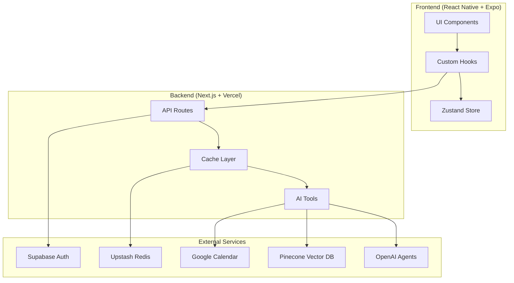
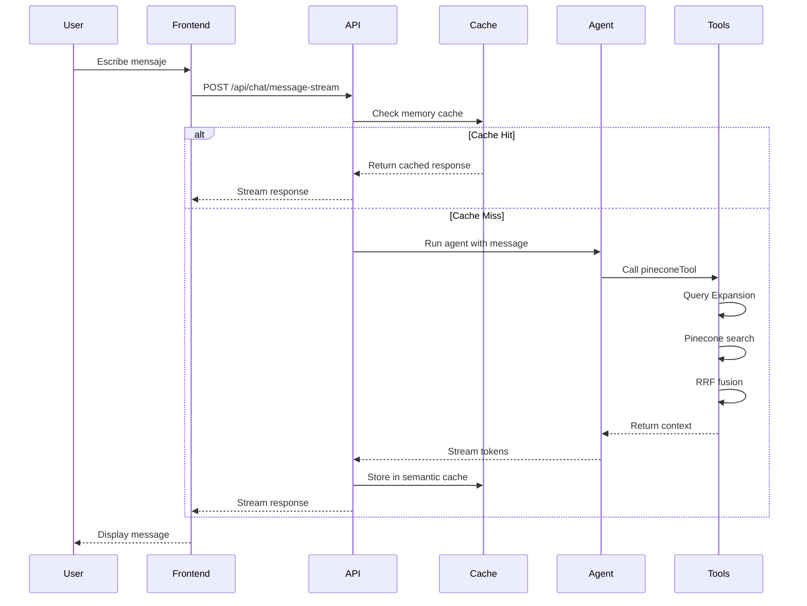
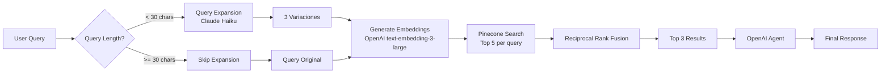

# Plan de Mejoras para Documentación

**Fecha de creación**: 8 de noviembre de 2025
**Estado actual**: 5/5 ⭐ - Documentación técnica excelente
**Meta**: Mantener 5/5 ⭐ + Agregar docs de usuario y visuales

---

## 📊 Estado Actual de Documentación

### ✅ Documentación Existente (EXCELENTE)

**Documentos técnicos:**
- ✅ [README.md](README.md) - Setup general (Rork template)
- ✅ [SETUP.md](SETUP.md) - Guía de configuración detallada
- ✅ [REPORTE_SERVICES_APIS_COMPLETO.md](REPORTE_SERVICES_APIS_COMPLETO.md) - **945 líneas** de arquitectura exhaustiva
- ✅ [RESUMEN_EJECUTIVO.md](RESUMEN_EJECUTIVO.md) - Resumen para stakeholders
- ✅ [QUICK_REFERENCE.md](QUICK_REFERENCE.md) - Referencia rápida de APIs
- ✅ [CONVERSION-PWA-COMPLETADA.md](CONVERSION-PWA-COMPLETADA.md) - **495 líneas** de guía PWA
- ✅ [PWA-README.md](PWA-README.md) - Documentación PWA detallada
- ✅ [AUTENTICACION.md](AUTENTICACION.md) - Guía de autenticación
- ✅ [TESTING.md](TESTING.md) - Guía de testing
- ✅ [DEPLOY_BACKEND.md](DEPLOY_BACKEND.md) - Deploy a Vercel

**Backend docs:**
- ✅ [backend/README.md](backend/README.md) - Setup backend
- ✅ [backend/CONFIGURACION.md](backend/CONFIGURACION.md) - Configuración detallada
- ✅ [backend/MIGRATION_SUMMARY.md](backend/MIGRATION_SUMMARY.md) - Migración de arquitectura

**Estado**: 🌟 Documentación técnica de nivel **ENTERPRISE**

### ❌ Gaps Identificados

**Falta:**
1. ❌ **API Reference completo** (Swagger/OpenAPI spec)
2. ❌ **Diagramas visuales** (arquitectura, flujos)
3. ❌ **CONTRIBUTING.md** (guía de contribución)
4. ❌ **CHANGELOG.md** (historial de cambios)
5. ❌ **Troubleshooting Guide** detallado
6. ❌ **User Documentation** (guía para usuarios finales)
7. ❌ **Deployment Guide** paso a paso para producción
8. ❌ **Performance Benchmarks** documentados
9. ❌ **Security Policy** (SECURITY.md)

---

## 🎯 Objetivos del Plan

### Fase 1 (Semana 1): Docs Esenciales
**Meta**: Completar documentación crítica para desarrollo

1. **API Reference (OpenAPI)**
   - Especificación completa de todos los endpoints
   - Schemas de request/response
   - Ejemplos de uso
   - Errores posibles

2. **CONTRIBUTING.md**
   - Code style guide
   - Commit message conventions
   - PR process
   - Branch naming

3. **CHANGELOG.md**
   - Historial de versiones
   - Features agregadas
   - Bugs corregidos
   - Breaking changes

### Fase 2 (Semana 2): Visualización
**Meta**: Hacer la arquitectura más accesible

4. **Diagramas de Arquitectura**
   - Diagrama de componentes (frontend)
   - Diagrama de flujo de datos
   - Diagrama de secuencia (chat flow)
   - Arquitectura RAG (Pinecone + Query Expansion)

5. **Diagramas de Flujo**
   - Flujo completo de chat
   - Flujo de autenticación
   - Flujo de PWA installation
   - Flujo de cache (memory → semantic → Pinecone)

### Fase 3 (Semana 3): Docs de Usuario
**Meta**: Documentación para stakeholders y usuarios

6. **User Guide**
   - Cómo usar la app
   - Features disponibles
   - FAQ para usuarios
   - Solución de problemas comunes

7. **Deployment Guide**
   - Pre-requisitos
   - Variables de entorno
   - Deploy de frontend (Expo)
   - Deploy de backend (Vercel)
   - Configuración de servicios (Pinecone, Supabase, etc.)

8. **Troubleshooting Guide**
   - Errores comunes y soluciones
   - Debugging tips
   - Performance issues
   - Network problems

### Fase 4 (Mes 2): Docs Avanzadas
**Meta**: Documentación para mantenimiento y seguridad

9. **Performance Benchmarks**
   - Métricas de respuesta de APIs
   - Impacto de optimizaciones
   - Comparación antes/después
   - Recomendaciones

10. **Security Policy (SECURITY.md)**
    - Reporte de vulnerabilidades
    - Política de seguridad
    - Auditoría de dependencias
    - Mejores prácticas

11. **Architecture Decision Records (ADRs)**
    - Por qué Pinecone vs otras opciones
    - Por qué Query Expansion
    - Por qué Claude Haiku vs otros modelos
    - Trade-offs documentados

---

## 📝 Contenido Detallado de Cada Doc

### 1. API Reference (OpenAPI Spec)

**Archivo**: `backend/openapi.yaml`

**Herramienta**: Generar automáticamente con [tsoa](https://tsoa-community.github.io/docs/)

**Contenido**:
```yaml
openapi: 3.0.0
info:
  title: Parroquias Chatbot API
  version: 1.0.0
  description: API REST para chatbot parroquial con RAG

servers:
  - url: https://parroquias-backend.vercel.app
    description: Production
  - url: http://localhost:3000
    description: Development

paths:
  /api/chat/message-stream:
    post:
      summary: Enviar mensaje con streaming
      description: Endpoint principal para chat con respuesta en tiempo real (SSE)
      tags:
        - Chat
      requestBody:
        required: true
        content:
          application/json:
            schema:
              type: object
              properties:
                message:
                  type: string
                  description: Mensaje del usuario
                  example: "¿Qué es un bautismo?"
                conversationHistory:
                  type: array
                  items:
                    $ref: '#/components/schemas/Message'
      responses:
        '200':
          description: Streaming response (text/event-stream)
        '400':
          description: Bad request o contenido inapropiado
        '500':
          description: Error interno del servidor

components:
  schemas:
    Message:
      type: object
      properties:
        role:
          type: string
          enum: [user, assistant]
        content:
          type: string
        timestamp:
          type: string
          format: date-time
```

**Implementación**:
1. Instalar tsoa: `npm install --save-dev tsoa`
2. Anotar controllers con decoradores tsoa
3. Generar spec: `tsoa spec`
4. Servir en `/api/docs` con Swagger UI

---

### 2. CONTRIBUTING.md

**Archivo**: `CONTRIBUTING.md`

**Contenido**:
```markdown
# Guía de Contribución

¡Gracias por contribuir al Chatbot Parroquial!

## Code Style

### TypeScript
- Usar `const` por defecto, `let` solo si es necesario
- Tipos explícitos en funciones públicas
- Nombres descriptivos (no abreviaturas)

### Formatting
- Prettier configurado (2 espacios, comillas simples)
- ESLint activado (modo strict)
- Run: `npm run lint` antes de commit

## Commit Messages

Seguimos [Conventional Commits](https://www.conventionalcommits.org/):

```
<type>(<scope>): <description>

[optional body]

[optional footer]
```

**Types**:
- `feat`: Nueva feature
- `fix`: Bug fix
- `docs`: Cambios en documentación
- `style`: Formatting (no afecta código)
- `refactor`: Refactoring de código
- `test`: Agregar o modificar tests
- `chore`: Tareas de mantenimiento

**Ejemplos**:
```
feat(chat): agregar soporte para attachments

Permite al usuario adjuntar imágenes al chat.
Integración con Expo Image Picker.

Closes #123
```

## Branch Naming

- `feat/nombre-feature` - Nueva feature
- `fix/nombre-bug` - Bug fix
- `docs/nombre-doc` - Documentación
- `refactor/nombre` - Refactoring

## Pull Request Process

1. Crear branch desde `main`
2. Implementar cambios con commits atómicos
3. Escribir tests (si aplica)
4. Correr `npm test` y `npm run lint`
5. Crear PR con descripción detallada
6. Esperar review (mínimo 1 aprobación)
7. Merge con squash

## Testing

- Tests requeridos para nueva funcionalidad crítica
- Mantener cobertura > 60%
- Ver [PLAN_MEJORAS_TESTING.md](PLAN_MEJORAS_TESTING.md)

## Questions?

Abre un issue con la etiqueta `question`.
```

---

### 3. CHANGELOG.md

**Archivo**: `CHANGELOG.md`

**Formato**: [Keep a Changelog](https://keepachangelog.com/)

**Contenido**:
```markdown
# Changelog

All notable changes to this project will be documented in this file.

The format is based on [Keep a Changelog](https://keepachangelog.com/en/1.0.0/),
and this project adheres to [Semantic Versioning](https://semver.org/spec/v2.0.0.html).

## [Unreleased]

### Added
- Plan de mejoras para testing
- Plan de mejoras para documentación

### Fixed
- Script test-real-queries.ts corregido
- Tipos TypeScript en tests (@types/jest agregado)

### Removed
- Archivos de respaldo innecesarios (.bak)

## [1.0.0] - 2025-10-26

### Added
- PWA completa con service worker
- Manifest.json y iconos (10 tamaños)
- Componente InstallPWA con banner
- Offline page

### Changed
- Actualizado Expo a versión 54.0.20
- Migrado a React Native 0.81.5

## [0.9.0] - 2025-10-22

### Added
- Query Expansion con Claude Haiku 4.5
- Reciprocal Rank Fusion (RRF) para mejorar recall
- Optimización condicional (solo queries < 30 chars)
- Pre-filtering conversacional

### Changed
- Sistema RAG optimizado con intelligent chunking V2

### Fixed
- Indicadores de progreso mejorados
- Latencia reducida en queries largas

## [0.8.0] - 2025-10-17

### Added
- Sistema de cache semántico con Redis
- Memory cache para 43 FAQs frecuentes
- Streaming SSE para mejor UX
- Content Moderation con OpenAI

### Changed
- Migración de ChatGPT API a OpenAI Agents SDK

### Fixed
- Timeouts ajustados (60s para /message-stream)

## [0.7.0] - 2025-10-15

### Added
- Autenticación completa con Supabase
- Dark mode en toda la app
- Sistema de logging estructurado
- Animaciones mejoradas

### Changed
- Rediseño de UI siguiendo guías de Apple

## [0.6.0] - 2025-10-14

### Added
- Integración con Pinecone para RAG
- Backend con Next.js 15 en Vercel
- Google Calendar integration
- Tools: pineconeTool, calendarTool, resourcesTool

## [0.5.0] - 2025-10-10

### Added
- Chat básico funcional
- Navegación por tabs
- Screens: Home, Calendar, Chat, Settings

## [0.1.0] - 2025-09-15

### Added
- Setup inicial del proyecto con Expo
- Estructura base con Expo Router
- Configuración de TypeScript y ESLint

[Unreleased]: https://github.com/user/repo/compare/v1.0.0...HEAD
[1.0.0]: https://github.com/user/repo/compare/v0.9.0...v1.0.0
[0.9.0]: https://github.com/user/repo/compare/v0.8.0...v0.9.0
```

---

### 4. Diagramas de Arquitectura

**Herramienta**: [Mermaid](https://mermaid.js.org/) (se integra con GitHub Markdown)

**Ubicación**: `docs/diagrams/` o en archivos .md existentes

#### Diagrama 1: Arquitectura General



#### Diagrama 2: Flujo de Chat



#### Diagrama 3: Arquitectura RAG



**Implementación**: Agregar estos diagramas a `REPORTE_SERVICES_APIS_COMPLETO.md` o crear `docs/ARCHITECTURE.md`

---

### 5. Troubleshooting Guide

**Archivo**: `TROUBLESHOOTING.md`

**Contenido**:
```markdown
# Troubleshooting Guide

## Frontend Issues

### App no carga en iOS Simulator

**Síntoma**: "Metro bundler not running"

**Solución**:
```bash
# Limpiar cache
npx expo start --clear

# Si persiste
rm -rf .expo node_modules
npm install
npx expo start
```

### Dark mode no funciona

**Síntoma**: App siempre en modo claro

**Causa**: Configuración de sistema operativo

**Solución**:
1. iOS: Settings > Display & Brightness > Dark
2. Android: Settings > Display > Dark theme
3. App respeta configuración del sistema

### Mensajes no se envían

**Síntoma**: Botón de enviar no responde

**Debug**:
1. Verificar console logs: `npx expo start`
2. Revisar network tab en React Native Debugger
3. Verificar que backend esté corriendo

**Solución común**:
```typescript
// Verificar en hooks/useChat.ts que la URL sea correcta
const BACKEND_URL = process.env.EXPO_PUBLIC_BACKEND_URL;
console.log('Backend URL:', BACKEND_URL); // Debe mostrar URL válida
```

## Backend Issues

### Error: "PINECONE_API_KEY not found"

**Síntoma**: Backend crash al iniciar

**Causa**: Variables de entorno no configuradas

**Solución**:
```bash
cd backend
cp .env.example .env
# Editar .env con tus API keys
```

### Timeout en requests

**Síntoma**: "Request timeout after 60000ms"

**Causa**: Query muy compleja o servicios externos lentos

**Solución temporal**:
1. Verificar que Pinecone esté accesible
2. Revisar logs de OpenAI (rate limits?)
3. Aumentar timeout en route.ts:
```typescript
export const maxDuration = 120; // 2 minutos
```

### Error: "Pinecone index not found"

**Síntoma**: 404 al buscar en Pinecone

**Solución**:
1. Verificar nombre de índice en .env: `PINECONE_INDEX_NAME=parroquias`
2. Crear índice si no existe:
```bash
cd backend/scripts
npx tsx upload-intelligent-to-pinecone.ts
```

## Testing Issues

### Tests fallan con error de tipos

**Síntoma**: "Cannot find name 'describe'"

**Solución**:
```bash
npm install --save-dev @types/jest
```

### Tests de hooks fallan

**Síntoma**: "Invalid hook call"

**Causa**: No usar renderHook de testing-library

**Solución**:
```typescript
import { renderHook } from '@testing-library/react-hooks';

// ✅ Correcto
const { result } = renderHook(() => useChat());

// ❌ Incorrecto
const result = useChat();
```

## Deployment Issues

### Vercel build falla

**Síntoma**: "Module not found: Cannot resolve 'backend/app/...'"

**Causa**: Path alias no configurado en Vercel

**Solución**:
```json
// vercel.json
{
  "buildCommand": "cd backend && npm install && npm run build"
}
```

### PWA no se instala

**Síntoma**: Banner de instalación no aparece

**Requisitos**:
1. HTTPS (localhost funciona también)
2. Manifest.json válido
3. Service worker registrado
4. Al menos 1 icono de 192x192 y 512x512

**Debug**:
1. Chrome DevTools > Application > Manifest
2. Verificar errores en Console
3. Chrome DevTools > Application > Service Workers

## Performance Issues

### Chat muy lento

**Debug checklist**:
1. ¿Está usando memory cache? (Ver console: "✅ [Memory Cache] Cache hit")
2. ¿Queries largas con expansion innecesaria? (Aumentar threshold a 40 chars)
3. ¿Pinecone responde lento? (Verificar región)
4. ¿OpenAI Agent timeout? (Aumentar timeout)

**Soluciones**:
- Agregar más entries a memory cache
- Ajustar threshold de Query Expansion
- Usar Claude Haiku en lugar de Sonnet

### Bundle size muy grande

**Síntoma**: App tarda mucho en cargar

**Solución**:
```bash
# Analizar bundle
npx expo export --platform web
npx source-map-explorer web-build/static/js/*.js
```

Eliminar imports innecesarios, usar lazy loading.

## Getting More Help

1. Revisar logs detallados:
   - Frontend: `npx expo start`
   - Backend: Vercel dashboard > Functions > Logs

2. Buscar en issues: https://github.com/user/repo/issues

3. Crear nuevo issue con:
   - Descripción del problema
   - Pasos para reproducir
   - Logs relevantes
   - Environment (OS, Node version, etc.)
```

---

## 🔧 Herramientas Recomendadas

### Para generar documentación:

1. **OpenAPI/Swagger**
   - [tsoa](https://tsoa-community.github.io/docs/) - Generar OpenAPI desde TypeScript
   - [Swagger UI](https://swagger.io/tools/swagger-ui/) - Visualizar API docs

2. **Diagramas**
   - [Mermaid](https://mermaid.js.org/) - Diagramas en Markdown (integrado con GitHub)
   - [Draw.io](https://app.diagrams.net/) - Diagramas visuales avanzados
   - [Excalidraw](https://excalidraw.com/) - Sketches rápidos

3. **Documentación de código**
   - [TypeDoc](https://typedoc.org/) - Generar docs desde JSDoc comments
   - [Docusaurus](https://docusaurus.io/) - Site completo de documentación

4. **Changelog**
   - [conventional-changelog](https://github.com/conventional-changelog/conventional-changelog) - Generar CHANGELOG automáticamente

---

## 🚦 Checklist de Implementación

### Fase 1: Docs Esenciales (Semana 1)

- [ ] Instalar tsoa y configurar
- [ ] Generar OpenAPI spec de todos los endpoints
- [ ] Servir Swagger UI en `/api/docs`
- [ ] **Crear CONTRIBUTING.md**
  - [ ] Code style guide
  - [ ] Commit conventions
  - [ ] PR process
  - [ ] Branch naming
- [ ] **Crear CHANGELOG.md**
  - [ ] Formato Keep a Changelog
  - [ ] Historial completo desde v0.1.0
  - [ ] Links a GitHub releases

### Fase 2: Visualización (Semana 2)

- [ ] **Agregar diagramas Mermaid**
  - [ ] Arquitectura general
  - [ ] Flujo de chat (secuencia)
  - [ ] Arquitectura RAG
  - [ ] Flujo de autenticación
  - [ ] Flujo de cache
- [ ] Integrar diagramas en docs existentes
- [ ] Crear `docs/ARCHITECTURE.md` con todos los diagramas

### Fase 3: Docs de Usuario (Semana 3)

- [ ] **Crear USER_GUIDE.md**
  - [ ] Instalación (iOS, Android, PWA)
  - [ ] Cómo usar el chat
  - [ ] Features disponibles
  - [ ] FAQ para usuarios
- [ ] **Crear DEPLOYMENT.md**
  - [ ] Pre-requisitos
  - [ ] Setup de servicios externos
  - [ ] Deploy frontend (Expo EAS)
  - [ ] Deploy backend (Vercel)
  - [ ] Variables de entorno
  - [ ] Health checks
- [ ] **Crear TROUBLESHOOTING.md** (ver template arriba)

### Fase 4: Docs Avanzadas (Mes 2)

- [ ] **Crear PERFORMANCE.md**
  - [ ] Benchmarks actuales
  - [ ] Impacto de optimizaciones
  - [ ] Recomendaciones
- [ ] **Crear SECURITY.md**
  - [ ] Política de seguridad
  - [ ] Reporte de vulnerabilidades
  - [ ] Auditoría de dependencias
- [ ] **Crear ADRs (Architecture Decision Records)**
  - [ ] ADR-001: Por qué Pinecone
  - [ ] ADR-002: Por qué Query Expansion
  - [ ] ADR-003: Por qué Claude Haiku
  - [ ] ADR-004: Estrategia de cache

---

## 📈 Mantenimiento de Documentación

### Proceso continuo:

1. **Al agregar nueva feature**:
   - Actualizar README si afecta setup
   - Agregar entry en CHANGELOG.md
   - Actualizar OpenAPI spec si agrega endpoint
   - Agregar ejemplo de uso

2. **Al corregir bug**:
   - Agregar entry en CHANGELOG.md
   - Si es bug común, agregar a TROUBLESHOOTING.md

3. **Al hacer breaking change**:
   - Agregar en CHANGELOG.md con etiqueta `[BREAKING]`
   - Actualizar MIGRATION_GUIDE.md con pasos de migración
   - Comunicar en PR y release notes

### Review mensual:

- [ ] Verificar que docs estén actualizados con código
- [ ] Revisar issues de GitHub relacionados con docs
- [ ] Actualizar benchmarks de performance
- [ ] Verificar que links funcionen
- [ ] Actualizar screenshots si UI cambió

---

## 💡 Mejores Prácticas

### DO:
- ✅ Mantener docs cerca del código (en mismo repo)
- ✅ Usar ejemplos reales y funcionales
- ✅ Incluir screenshots/diagramas cuando sea útil
- ✅ Documentar el "por qué", no solo el "qué"
- ✅ Mantener CHANGELOG actualizado con cada release
- ✅ Usar lenguaje claro y conciso

### DON'T:
- ❌ Documentar código obvio (el código debe ser auto-explicativo)
- ❌ Dejar docs desactualizados (peor que no tener docs)
- ❌ Duplicar información entre múltiples docs
- ❌ Usar jerga técnica sin explicación
- ❌ Docs muy largos sin tabla de contenidos

---

## 🎯 Próximos Pasos Inmediatos

**Esta semana:**

1. Crear CONTRIBUTING.md (1 hora)
2. Crear CHANGELOG.md con historial completo (2 horas)
3. Instalar y configurar tsoa para OpenAPI (3 horas)
4. Agregar primeros diagramas Mermaid a docs existentes (2 horas)
5. Crear TROUBLESHOOTING.md básico (1 hora)

**Total estimado Fase 1**: ~9 horas de trabajo

---

**Última actualización**: 8 de noviembre de 2025
**Responsable**: Equipo de desarrollo
**Próxima revisión**: 15 de noviembre de 2025
