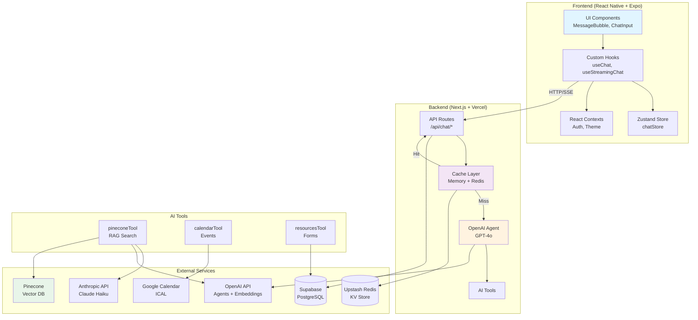
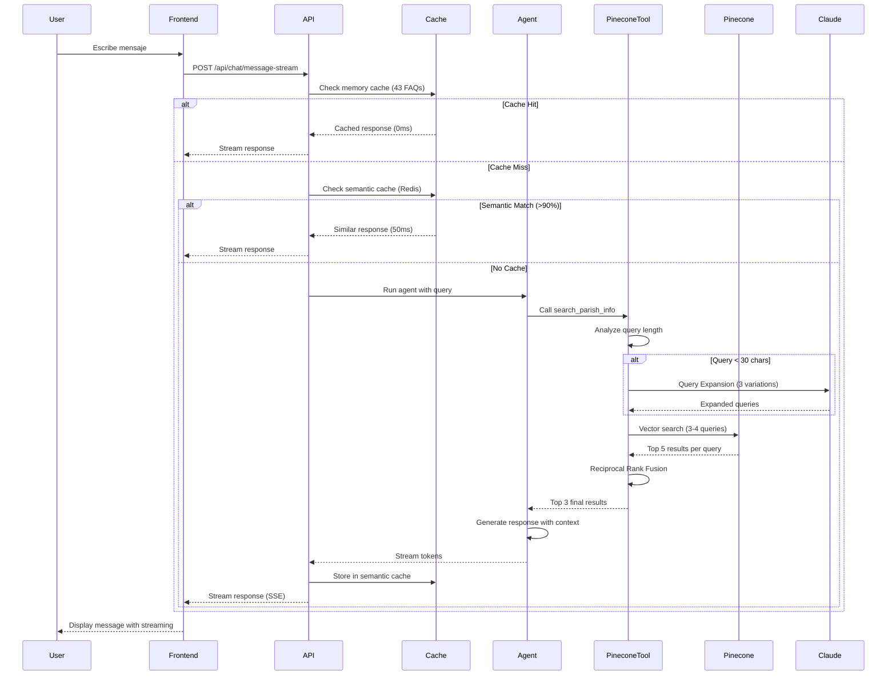

# REPORTE EXHAUSTIVO: SERVICIOS, APIs Y LÓGICA DE NEGOCIO
## React Native App PARROQUIA (Expo Router + Next.js Backend)

**Fecha de Análisis:** Octubre 2025  
**Versión App:** 1.0.0  
**Stack:** Expo 54, React Native 0.81, React 19, Next.js 15, TypeScript  
**Estado:** ✅ Completamente funcional con arquitectura RAG optimizada

---

## 1. ARQUITECTURA GENERAL

### Stack Tecnológico

**Frontend (React Native - Expo):**
- Expo Router 6.0 (file-based routing)
- React Native 0.81.5
- React 19.1.0
- NativeWind 4.1 (Tailwind para React Native)
- React Query (@tanstack) 5.90.3
- Zustand 5.0.8 (state management)
- expo-router para navegación
- Expo Secure Store para credenciales

**Backend (Next.js Full Stack):**
- Next.js 15.1.4 con API Routes (Edge Runtime)
- OpenAI Agents SDK
- Anthropic SDK (Claude 3.5 Haiku)
- Pinecone (Vector DB)
- Redis/Vercel KV (caching)
- Supabase (auth + DB)
- ICAL.js (calendar parsing)
- Resend (email service)

**Base de Datos:**
- Supabase (PostgreSQL) → Profiles, Auth, Saints, Gospels
- Pinecone (Vector Store) → 71 documentos parroquiales (24 PDFs + 47 chunks)
- Redis Cloud → Semantic cache (1h TTL)
- Memory Cache → FAQ data (43 preguntas)

### Diagrama de Arquitectura General



### Flujo de Datos: User Query → Response



---

## 2. GESTIÓN DE ESTADO

### 2.1 Zustand Store (Global State)
**Archivo:** `/stores/chatStore.ts`

```typescript
type ChatState = {
  messages: Message[];
  inputText: string;
  
  // Acciones
  setInputText: (text: string) => void;
  clearMessages: () => void;
  addMessage: (message: Message) => void;
  updateMessage: (id: string, updates: Partial<Message>) => void;
};
```

**Persistencia:**
- AsyncStorage (React Native)
- Solo persiste `messages` (no inputText)
- TTL: indefinido hasta clear manual

**Uso:**
- Chat messages (conversación)
- Input text (campo de entrada)
- Optimistic updates (UI feedback)

### 2.2 React Context - Autenticación
**Archivo:** `/contexts/AuthContext.tsx`

**Estado:**
```typescript
type AuthContextType = {
  session: Session | null;
  profile: Profile | null;
  loading: boolean;
  error: string | null;
  isSupabaseConfigured: boolean;
  
  // Métodos
  refreshSession(): Promise<void>;
  signIn(email, password): Promise<void>;
  signUp(email, password, fullName?, phone?): Promise<void>;
  signOut(): Promise<void>;
  resetPassword(email): Promise<void>;
  updateProfile(updates): Promise<void>;
};
```

**Características:**
- Auto-refresh de tokens
- Session persistence
- Profile fetching automático
- Error handling centralizado

### 2.3 React Context - Temas
**Archivo:** `/contexts/ThemeContext.tsx`

**Estado:**
```typescript
type ThemeContextType = {
  theme: Theme;
  themeMode: 'light' | 'dark' | 'system';
  isDark: boolean;
  
  setThemeMode(mode): void;
  toggleTheme(): void;
};
```

**Características:**
- Sincronización con NativeWind
- Persistencia en AsyncStorage
- Detección automática de preferencia del sistema
- Colores definidos: light/dark themes

### 2.4 React Query
**Configuración Global:** `/app/_layout.tsx`

```typescript
const queryClient = new QueryClient({
  defaultOptions: {
    queries: {
      staleTime: 5 * 60 * 1000,  // 5 minutos
      gcTime: 10 * 60 * 1000,     // 10 minutos
    },
    mutations: {
      retry: 0,       // ❌ SIN retry (cada mensaje es único)
      gcTime: 0,      // ❌ SIN cache (evita duplicados)
    },
  },
});
```

**Hooks que usan React Query:**
- `useQuery` para fetch de saints/gospels (daily content)
- `useMutation` para send messages (optimizado)

---

## 3. SERVICIOS Y APIs

### 3.1 Supabase Client
**Archivo:** `/lib/supabase.ts`

**Configuración:**
```typescript
- URL: https://fqixdguidesjgovbwkua.supabase.co
- Anon Key: [EXPO_PUBLIC_SUPABASE_ANON]
- Auth: AsyncStorage persistence + autoRefreshToken
- Operaciones: SELECT/INSERT/UPDATE en auth.users y profiles table
```

**Tablas Principales:**
- `profiles` → id, email, full_name, phone, avatar_url, role, date_of_birth, address, city
- `saints` → Daily liturgical calendar (nombre del santo por fecha)
- `gospels` → Gospel readings by date
- `auth.users` → Supabase Auth users

**Triggers:**
- `handle_new_user` → Crea profile automático en signup

### 3.2 Backend APIs

#### Chat Endpoints:

**1. `/api/chat/message` (POST) - Full Response**
- ✅ Usa OpenAI Agent SDK
- ✅ Pinecone + Calendar Tools
- ✅ Semantic Cache (Redis)
- ✅ Conversational Rewriting (Claude Haiku)
- ⏱️ Timeout: 60s
- **Parámetros:** message, conversationHistory
- **Response:** { message, attachments[], quickActions{}, fromCache, quick, generic }

**2. `/api/chat/message-stream` (POST) - Streaming Response**
- ✅ Server-Sent Events (SSE)
- ✅ Pinecone + Agent + Streaming para latencia baja
- ✅ Conversational Rewriting automático
- ✅ Status updates: 'searching' → 'writing'
- ⏱️ Timeout: 60s
- **Eventos SSE:**
  - `message` → Chunks de texto
  - `status` → { status: 'searching'|'writing' }
  - `done` → { attachments[], quickActions{} }
  - `error` → Error message

**3. `/api/chat/quick` (POST) - Fast Cache Response**
- ✅ Memory Cache → 0ms latencia
- ✅ Fallback a GPT-4o-mini si no encuentra
- ✅ Quick Actions automáticos
- ⏱️ Timeout: 15s
- **Response:** { message, fromCache, quick: true, quickActions{} }

**4. `/api/chat/quick-stream` (POST) - Fast Streaming**
- ✅ SSE streaming desde GPT-4o-mini
- ✅ Sin herramientas (máxima velocidad)
- ⏱️ Timeout: 15s
- **Igual que message-stream pero sin Agent**

**5. `/api/chat/detect` (POST) - Message Type Detection**
- Detecta si query necesita Calendar vs Pinecone
- **Response:** { type: 'full'|'quick', reason: string }

**6. `/api/chat/cache-stats` (GET) - Debug**
- Estadísticas de cache (Redis + Memory)
- Útil para monitoring

#### Authentication Endpoints:

**1. `/api/auth/register` (POST)**
- Email + password + full_name + phone
- Trigger automático crea profile
- Response: { success, user, session }

**2. `/api/auth/login` (POST)**
- Email + password
- Response: { success, user, session { access_token, refresh_token, expires_at } }

**3. `/api/auth/verify-token` (POST)**
- Token validation
- Response: { valid, user }

**4. `/api/auth/confirm-user` (POST)**
- Email confirmation link
- Response: { success }

**5. `/api/auth/forgot-password` (POST)**
- Email para reset
- Envía email con enlace
- Response: { success }

**6. `/api/auth/reset-password` (POST)**
- Reset token + new password
- Response: { success }

#### Calendar Endpoint:

**1. `/api/calendar/events` (GET)**
- Fetch eventos desde Google Calendar (ICS)
- Query params: ?date=YYYY-MM-DD, ?dateRange=start,end
- Cache: 2 minutos
- **Response:** { events: CalendarEvent[] }

#### Admin/Debug Endpoints:

- `/api/admin/populate-cache` → Carga FAQ en memory cache
- `/api/admin/populate-redis` → Carga en Redis Cloud
- `/api/admin/sync-redis-from-memory` → Sincroniza caches
- `/api/admin/redis-diagnostics` → Health check
- `/api/debug/logger` → Dashboard de logs en tiempo real

---

## 4. TOOLS Y HERRAMIENTAS RAG

### 4.1 Pinecone Tool
**Archivo:** `/backend/app/api/chat/tools/pineconeTool.ts`

**Configuración:**
- Índice: `parroquias`
- Dimensiones: 3072
- Modelo Embedding: `text-embedding-3-large`
- Documentos: 71 vectorizados (24 PDFs + 47 chunks markdown)
- Región: us-east-1 (AWS)

**Optimizaciones RAG 2025:**
1. **Query Expansion** → 3 variaciones generadas por Claude Haiku
2. **Reciprocal Rank Fusion** → Combina resultados de múltiples búsquedas
3. **Metadata filtering** → Por tipo de documento, grupo, etc.

#### Diagrama del Sistema RAG con Query Expansion

```mermaid
graph LR
    Query[User Query] --> Detector{Query Length?}

    Detector -->|< 30 chars<br/>Corta| Expansion[Query Expansion<br/>Claude Haiku 4.5]
    Detector -->|>= 30 chars<br/>Larga| Skip[Skip Expansion]

    Expansion --> Variants[3 Variaciones<br/>+ Query Original]
    Skip --> Single[Solo Query Original]

    Variants --> Embed[Generate Embeddings<br/>OpenAI text-embedding-3-large<br/>3072 dimensions]
    Single --> Embed

    Embed --> ParallelSearch[Parallel Pinecone Search<br/>Top 5 per query]

    ParallelSearch --> Results[Results Sets<br/>3-4 conjuntos de resultados]

    Results --> RRF[Reciprocal Rank Fusion<br/>score = Σ 1/(k + rank)]

    RRF --> Top3[Top 3 Final Results<br/>Best combined score]

    Top3 --> Format[Format Content<br/>1000 chars max per result]

    Format --> Agent[Return to OpenAI Agent]

    Agent --> Response[Final Response to User]

    style Query fill:#e3f2fd
    style Expansion fill:#fff9c4
    style Embed fill:#f3e5f5
    style RRF fill:#e8f5e9
    style Response fill:#ffe0b2
```

**Explicación del flujo**:

1. **Query Length Detection**:
   - Queries < 30 chars (ej: "testigos bautismo") → Query Expansion
   - Queries >= 30 chars (ej: "¿Qué documentos necesito para matrimonio?") → Skip expansion

2. **Query Expansion** (solo para queries cortas):
   - Claude Haiku 4.5 genera 3 variaciones semánticas
   - Preserva términos técnicos exactos (testigos ≠ padrinos)
   - Ejemplo: "testigos bautismo" → ["requisitos testigos bautismo", "información testigos para bautismo", "quiénes pueden ser testigos bautismo"]

3. **Embedding Generation**:
   - OpenAI text-embedding-3-large
   - 3072 dimensiones por vector
   - Proceso en paralelo para todas las queries

4. **Parallel Search**:
   - Cada embedding busca en Pinecone independientemente
   - Top 5 resultados por búsqueda
   - Total: 15-20 resultados candidatos

5. **Reciprocal Rank Fusion (RRF)**:
   - Formula: `score(doc) = Σ 1/(k + rank)` para cada query donde aparece
   - Documentos que aparecen en múltiples búsquedas reciben scores más altos
   - k = 60 (constante de RRF)

6. **Final Selection**:
   - Top 3 documentos después de RRF
   - Máximo 1000 caracteres por resultado
   - Retorno al Agent para generación de respuesta

**Respuesta:**
```
sources[] {
  id, title, content, score, source (PDF/Markdown)
}
```

### 4.2 Calendar Tool
**Archivo:** `/backend/app/api/chat/tools/calendarTool.ts`

**Fuente:** Google Calendar (ICS)
- URL configurada en env: `GOOGLE_CALENDAR_ICS_URL`
- Cache: 5 minutos
- Parseo: ICAL.js

**Responsabilidades:**
- Detectar queries de eventos dinámicos ("¿eventos hoy?", "mañana qué hay?")
- Retornar eventos filtrados por rango de fechas
- Formatear en español con timezone (Europe/Madrid)

**Retorna:**
```
events[] {
  id, title, start (ISO), end (ISO), 
  location, description, allDay
}
```

### 4.3 Resources Tool
**Archivo:** `/backend/app/api/chat/tools/resourcesTool.ts`

**Búsquedas de recursos:**
- PDFs de requisitos sacramentales
- Documentación de grupos parroquiales
- Formularios de inscripción
- Links útiles

---

## 5. INTEGRACIONES EXTERNAS

### 5.1 OpenAI
**Servicios utilizados:**

1. **OpenAI Agent SDK**
   - Agent orchestration con tools
   - Model: gpt-4o (reasoning + streaming)
   - Timeouts: 60s

2. **GPT-4o-mini**
   - `/api/chat/quick` para respuestas rápidas
   - Temperature: 0.5
   - Max tokens: 300
   - Timeouts: 15s

3. **GPT-4**
   - Query expansion refinement (cuando se necesita)

4. **OpenAI Moderation API**
   - Content filtering en mensajes
   - Prevención de spam/abuse

5. **Text Embeddings 3-Large**
   - Generación de embeddings para Pinecone
   - 3072 dimensiones

### 5.2 Anthropic (Claude)
**Servicios utilizados:**

1. **Claude 3.5 Haiku 20241022**
   - Query Expansion para mejores búsquedas Pinecone
   - Conversational Rewriting de follow-ups
   - Lightweight: ~50ms por request
   - Temperatura: 0.1 (determinístico)

### 5.3 Pinecone (Vector Database)
- Índice: `parroquias`
- 71 documentos vectorizados
- Dimensiones: 3072
- Búsqueda semántica + Reciprocal Rank Fusion
- API Key: PINECONE_API_KEY

### 5.4 Supabase (Database + Auth)
- **Auth:** Supabase built-in authentication
- **DB:** PostgreSQL con RLS
- **Real-time:** Subscriptions (no usadas actualmente)
- **Storage:** No usado
- **Service Role:** Backend only con permisos admin

### 5.5 Redis Cloud
- **Uso:** Semantic cache (respuestas)
- **TTL:** 1 hora (info parroquial)
- **Conexión:** ioredis con retry exponencial
- **Fallback:** Si Redis no responde, continúa sin cache

### 5.6 Vercel KV
- **Uso:** Rate limiting + Circuit Breaker
- **Datos:** Contadores de rate limit, estados de circuit breaker
- **TTL configurable**

### 5.7 Resend (Email)
- **Uso:** Email transaccional (confirmación, reset password)
- **Templates:** HTML personalizados
- **Headers:** DKIM/SPF configurado

### 5.8 Google Calendar
- **Formato:** ICS (iCal format)
- **Parsing:** ICAL.js
- **Cache:** 2 minutos (calendarios no cambian rápido)
- **Timezone:** Europe/Madrid

---

## 6. HOOKS PERSONALIZADOS

### 6.1 useChat
**Archivo:** `/hooks/useChat.ts`

**Responsabilidades:**
- Manage chat messages (Zustand)
- Handle message sending
- Streaming response updates
- Scroll management (FlatList)
- Quick Actions handling

**Métodos:**
```typescript
{
  messages,
  inputText,
  setInputText,
  isLoading: boolean,
  streamingStatus: 'searching' | null,
  scrollViewRef,
  handleSend(messageOverride?: string),
  handleQuickAction(button)
}
```

### 6.2 useStreamingChat
**Archivo:** `/hooks/useStreamingChat.ts`

**Responsabilidades:**
- SSE connection management
- Chunk parsing (JSON o raw text)
- Status event handling
- Error handling y cleanup

**Métodos:**
```typescript
{
  sendStreamingMessage({
    message,
    conversationHistory,
    endpoint,
    onChunk,
    onComplete,
    onError,
    onStatus
  }),
  cancelStreaming(),
  isStreaming
}
```

### 6.3 useIntelligentDetector
**Archivo:** `/hooks/useIntelligentDetector.ts`

**Responsabilidades:**
- Detecta si query es de calendario
- Todo lo demás → Pinecone
- Solo para analytics

**Métodos:**
```typescript
{
  detectMessageType(message, options): { type, reason }
}
```

### 6.4 useSendMessage
**Archivo:** `/hooks/useSendMessage.ts`

**Responsabilidades:**
- Mutation wrapper (React Query)
- API call management
- Timeout handling (15s quick, 60s full)
- Cache-Control headers
- Request ID tracking

**Usa:** `fetch()` moderno con AbortController

### 6.5 useDailyContent
**Archivo:** `/hooks/useDailyContent.ts`

**Responsabilidades:**
- Fetch saint of the day
- Fetch gospel of the day
- Cache con React Query
- Date handling (timezone-aware)

**Métodos:**
```typescript
{
  saint: Saint | null,
  gospel: Gospel | null,
  isLoading: boolean,
  error: Error | null,
  refetch(),
  isSupabaseConfigured
}
```

### 6.6 useQuickDetector
**Archivo:** `/hooks/useQuickDetector.ts` (Deprecated - ahora en backend)

**Antigua lógica:** Detectaba quick vs full en cliente
**Ahora:** Solo backend decide

### 6.7 Otros Hooks

- **useTheme** → Acceso a tema (light/dark/system)
- **useAuth** → Acceso a context de auth
- **useDebugLogger** → Logging centralizado
- **useKeyboardVisibility** → Detecta teclado
- **useInfiniteMessages** → Pagination de mensajes (experimental)
- **useExpandableDetector** → Detecta queries expandibles

---

## 7. UTILIDADES Y HELPERS

### 7.1 Liturgical Colors
**Archivo:** `/lib/liturgicalColors.ts`

**Función:** Determina color litúrgico y temporada según fecha

```typescript
enum LiturgicalColor = 'purple' | 'green' | 'white' | 'red' | 'rose';

interface LiturgicalSeason {
  name: string;
  color: LiturgicalColor;
  gradient: string[];
}

getLiturgicalSeason(date: Date): LiturgicalSeason
```

**Calendarios Implementados:**
- 2025-2026 con todas las solemnidades
- Adviento, Navidad, Cuaresma, Pascua, Tiempo Ordinario
- Domingos especiales (Gaudete, Laetare, Pentecostés)

### 7.2 Dayjs Configuration
**Archivo:** `/lib/dayjs.ts`

```typescript
Timezone: Europe/Madrid
Locale: Español (es)
Plugins: utc, timezone

getTodayDate(): string → "YYYY-MM-DD"
formatDate(date, format): string
parseDate(date): dayjs.Dayjs
```

### 7.3 Service Worker Registration
**Archivo:** `/utils/registerServiceWorker.ts`

**Funcionalidades:**
- Registra SW para PWA
- Install prompt management
- Offline support

### 7.4 Theme Design System
**Archivo:** `/constants/themes.ts`

**Define:**
- Light/Dark color palettes
- Spacing scale (xs, sm, md, lg, xl, 2xl, 3xl)
- Border radius scale
- Typography scales
- Shadow definitions
- Z-index scale

**Compatible con:** NativeWind, Tailwind CSS

---

## 8. INTELIGENCIA CONVERSACIONAL

### 8.1 Conversational Rewriting
**Ubicación:** `/backend/app/api/chat/message-stream/route.ts`

**Detecta:** Follow-up questions que necesitan contexto
**Reescribe:** Con Claude Haiku para ser auto-contenidas
**Ejemplo:**
```
Usuario anterior: "¿Qué es Eloos?"
Pregunta actual: "¿Y Bartimeo?"
Reescritura: "¿Qué es el grupo Bartimeo de la parroquia?"
```

### 8.2 Pre-filtro Conversacional
**Detecta sin RAG:**
- Greetings: "hola", "hey", "buenos días"
- Acknowledgments: "gracias", "ok", "vale"
- Chitchat: "cómo estás?", "qué tal?"
- **Responde con:** Plantillas fijas rápidas

### 8.3 Quick Actions (Botones Inteligentes)
**Archivo:** `/backend/app/api/chat/utils/quickActionsConfig.ts`

**Tipos de botones:**
1. **Type: 'message'** → Auto-envía mensaje (p.ej. "Dame más información")
2. **Type: 'url'** → Abre URL externa (p.ej. Typeform inscripción)

**Botón Fijo:**
```
📖 "Ver más información" → message action
```

**Botones Dinámicos por categoría:**
- Groups: 📝 Inscribirme (URL)
- Sacraments: 📋 Ver requisitos (message)
- Schedules: 📅 Ver horarios (message)
- Location: 📍 ¿Dónde está? (message)

**Anti-spam:** Se eliminan después de usar

---

## 9. CACHING ESTRATÉGICO

### 9.1 Memory Cache (FAQ)
**Archivo:** `/backend/app/api/chat/utils/memoryCache.ts`

**Características:**
- 43 FAQs pre-cargadas en memoria
- Búsqueda fuzzy de preguntas
- TTL: 1 hora
- Inicialización: Al startup
- **NO cachea:** Queries de calendario, respuestas genéricas

**Performance:** 0ms latencia

### 9.2 Semantic Cache (Redis)
**Archivo:** `/backend/app/api/chat/utils/semanticCache.ts`

**Características:**
- Respuestas basadas en similitud semántica
- TTL: 1 hora
- Conexión: Redis Cloud + ioredis
- **NO cachea:** Calendario, respuestas genéricas, preguntas cortas
- Fallback: Si Redis no responde, continúa sin cache

**Key format:** `semantic_cache:{normalized_question}`

### 9.3 Vercel KV (Global State)
- Rate limiter counters
- Circuit breaker states
- TTL variable

---

## 10. SEGURIDAD Y MODERACIÓN

### 10.1 Content Moderation
**Ubicación:** `/backend/app/api/chat/message/route.ts`

```typescript
async moderateContent(message: string): {
  flagged: boolean;
  categories?: string[];  // Tipo de contenido flagged
}
```

**Usa:** OpenAI Moderation API

### 10.2 Relevance Checking
**Ubicación:** `/backend/app/api/chat/message/route.ts`

**Detecta:** Preguntas no-parroquiales
**Ejemplos irrelevantes:**
- Bitcoin, crypto, trading
- Deportes, videojuegos
- Programación, recetas
- Política

**Respuesta:** "Solo puedo ayudarte con info de la parroquia..."

### 10.3 Rate Limiting
**Archivo:** `/backend/app/api/chat/utils/rateLimiter.ts`

**Configuración:**
- Máximo de requests por ventana de tiempo
- Identificador: IP o userId
- Response: { allowed, remaining, resetAt }

### 10.4 Circuit Breaker
**Archivo:** `/backend/app/api/chat/utils/rateLimiter.ts`

**Estados:**
- **CLOSED:** Normal (permite requests)
- **OPEN:** 5+ fallos (bloquea requests)
- **HALF-OPEN:** Probando recuperación

**Servicios protegidos:** OpenAI API

---

## 11. LOGGING Y DEBUGGING

### 11.1 Structured Logger
**Archivo:** `/backend/app/api/chat/utils/structuredLogger.ts`

**Niveles:**
- info, warn, error, debug
- Request tracking con IDs únicos
- Sanitización automática de mensajes sensibles
- Timestamps

### 11.2 Debug Dashboard
**Endpoint:** `/api/debug/logger`

**Características:**
- Logs en tiempo real desde backend
- Filtrado por level/requestId
- Dashboard HTML (development only)
- Timestamps precisos

---

## 12. CONFIGURACIÓN Y VARIABLES DE ENTORNO

### 12.1 Frontend (.env)
```bash
# Supabase
EXPO_PUBLIC_SUPABASE_URL=https://fqixdguidesjgovbwkua.supabase.co
EXPO_PUBLIC_SUPABASE_ANON=eyJhbGciOiJIUzI1NiIsInR5cCI6IkpXVCJ9...

# Backend API
EXPO_PUBLIC_API_BASE=https://chat-app-parroquias.vercel.app

# ChatKit (OpenAI workflow)
EXPO_PUBLIC_CHATKIT_WORKFLOW_ID=ywf_68ed475f35208190a1f93b097d23758402413a726b0c1a70

# Timezone
EXPO_PUBLIC_TIMEZONE=Europe/Madrid
```

### 12.2 Backend (.env.local)
```bash
# OpenAI
OPENAI_API_KEY=sk-...
ANTHROPIC_API_KEY=sk-ant-...

# Pinecone
PINECONE_API_KEY=...

# Supabase
SUPABASE_URL=https://fqixdguidesjgovbwkua.supabase.co
SUPABASE_SERVICE_ROLE_KEY=...

# Redis
REDIS_URL=redis://...

# Vercel KV
KV_REST_API_URL=...
KV_REST_API_TOKEN=...

# Google Calendar
GOOGLE_CALENDAR_ICS_URL=https://calendar.google.com/calendar/ical/...

# Email
RESEND_API_KEY=...

# Misc
NEXT_PUBLIC_URL=https://chat-app-parroquias.vercel.app
NODE_ENV=production
```

---

## 13. DEPENDENCIAS CRÍTICAS

### Frontend (`package.json`)
```json
{
  "expo": "54.0.20",
  "react": "19.1.0",
  "react-native": "0.81.5",
  "expo-router": "~6.0.13",
  
  "ai": "^5.0.71",  // Vercel AI SDK
  "@ai-sdk/react": "^2.0.71",
  "@openai/chatkit-react": "^1.0.0",
  
  "zustand": "^5.0.8",  // State management
  "@tanstack/react-query": "^5.90.3",
  
  "nativewind": "^4.1.23",  // Tailwind
  "expo-router": "~6.0.13",
  
  "react-native-sse": "^1.2.1",  // SSE streaming
  "@supabase/supabase-js": "^2.75.0",
  "@react-native-async-storage/async-storage": "2.2.0",
  
  "dayjs": "^1.11.18",  // Dates
  "react-native-calendars": "^1.1313.0",
  "zod": "^4.1.12"  // Validation
}
```

### Backend (`package.json`)
```json
{
  "next": "^15.1.4",
  "@openai/agents": "^0.1.9",
  "@anthropic-ai/sdk": "^0.67.0",
  "@pinecone-database/pinecone": "^6.1.2",
  
  "ai": "^5.0.71",  // Vercel AI SDK
  "@ai-sdk/openai": "^2.0.52",
  
  "openai": "^4.77.3",
  "ioredis": "^5.8.1",
  "@vercel/kv": "^3.0.0",
  
  "@supabase/supabase-js": "^2.75.0",
  "resend": "^6.1.3",
  
  "ical.js": "^2.2.1",  // Calendar parsing
  "zod": "^3.25.76"
}
```

---

## 14. FLUJOS PRINCIPALES

### 14.1 Chat Message Flow (Completo)

1. **Usuario envía mensaje** → `handleSend()` en useChat
2. **Optimistic update** → Mensaje se muestra inmediatamente
3. **Backend detection** → ¿Conversacional? ¿Calendario? ¿Pinecone?
4. **Si conversacional** → Respuesta rápida sin RAG (1-2s)
5. **Si calendario** → Fetch eventos + formatting
6. **Si Pinecone**:
   - Query Expansion (3 variaciones)
   - Búsqueda semántica
   - Reciprocal Rank Fusion
   - Pass a OpenAI Agent
7. **Streaming** → Chunks via SSE
8. **Status updates** → 'searching' → 'writing'
9. **Quick Actions** → Detecta contexto para botones
10. **UI update** → Streaming chunks se renderizan en tiempo real

### 14.2 Authentication Flow

1. User clicks "Register"
2. Supabase auth.signUp(email, password)
3. Trigger `handle_new_user` crea profile
4. Email confirmation sent (Resend)
5. User clicks link → auth state synced
6. Session stored en AsyncStorage
7. Auto-refresh token before expiry

### 14.3 Daily Content Flow

1. App startup → useDailyContent hook
2. React Query fetches saint + gospel by date
3. Cached por 5 minutos
4. Displayed en home screen
5. Liturgical colors aplicados dinámicamente

---

## 15. OPTIMIZACIONES IMPLEMENTADAS (2025)

✅ **Streaming responses** (70-80% mejora percibida)
✅ **Memory cache** (0ms latencia para FAQs)
✅ **Query Expansion** (mejor recall en Pinecone)
✅ **Conversational Rewriting** (follow-ups completos)
✅ **Pre-filter conversacional** (no RAG para saludos)
✅ **Quick Actions** (botones contextuales)
✅ **Circuit Breaker** (protección de OpenAI)
✅ **Rate Limiting** (anti-abuse)
✅ **Content Moderation** (OpenAI mod API)
✅ **Error Boundaries** (crash handling)
✅ **Service Worker** (PWA offline)
✅ **Optimistic Updates** (UI responsiva)

---

## 16. LIMITACIONES Y NOTAS

⚠️ **Streaming:**
- SSE puede tener issues en ciertos proxies corporativos
- Fallback a polling si needed

⚠️ **Pinecone:**
- 71 docs es base pequeña (expandir si crece FAQ)
- Query Expansion puede hacer 3x requests (OK con costos)

⚠️ **Redis:**
- Si no está disponible, continúa sin semantic cache
- Memory cache aún funciona (0ms)

⚠️ **Rate Limiting:**
- Implementado pero no stricto (fail-open)
- Puede customizarse por usuario

---

## 17. MATRICES DE TESTING

### Frontend Tests
- `/hooks/__tests__/useQuickDetector.test.ts`
- Message detection logic validado

### Backend Tests
- Memory cache tests
- Semantic cache tests
- Rate limiter tests

**Run tests:**
```bash
npm test
npm test:watch
npm test:coverage
```

---

## 18. DEPLOYMENT

### Frontend
- **Platform:** EAS (Expo Application Services)
- **Web:** Vercel / Next.js export

### Backend
- **Platform:** Vercel (Next.js Edge Runtime)
- **Database:** Supabase (managed PostgreSQL)
- **Vector DB:** Pinecone (managed)
- **Cache:** Redis Cloud + Vercel KV
- **Email:** Resend

**URLs:**
- Producción: https://chat-app-parroquias.vercel.app
- API Base: EXPO_PUBLIC_API_BASE = https://chat-app-parroquias.vercel.app

---

## 19. ROADMAP FUTURO

🔄 **Próximas optimizaciones:**
- Graph RAG (relaciones entre documentos)
- Voice input/output
- Offline message queueing
- Analytics dashboard
- Admin panel para FAQs
- Multi-language support
- Push notifications

---

**FIN DEL REPORTE**
Generated: Oct 26, 2025
